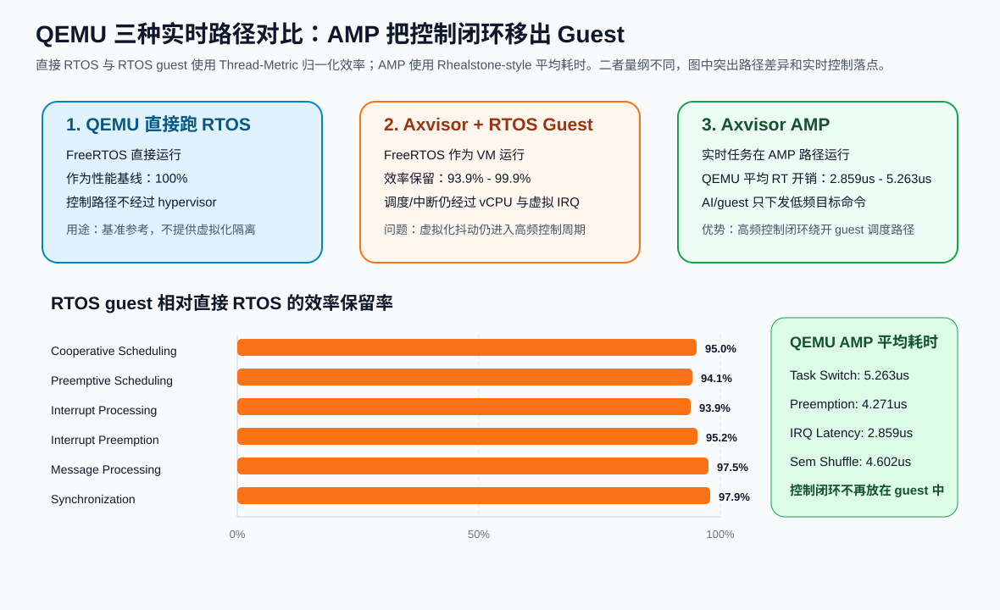
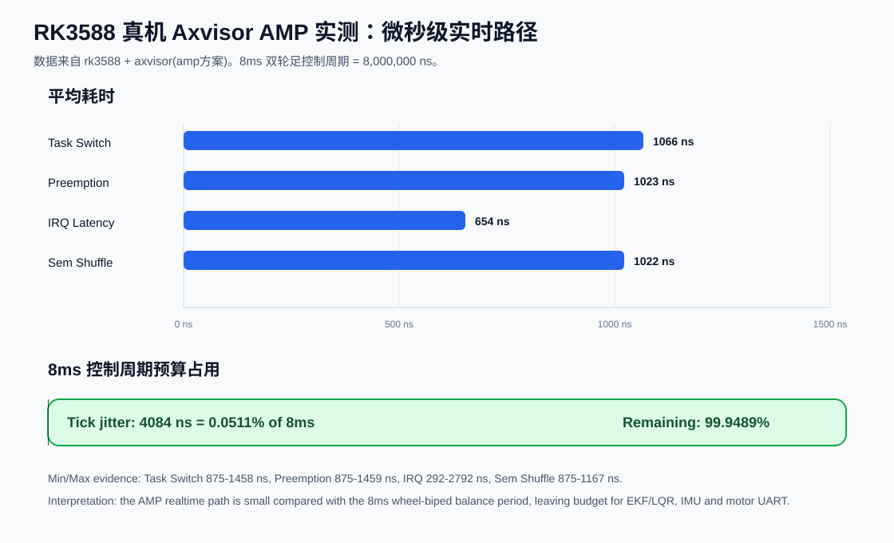
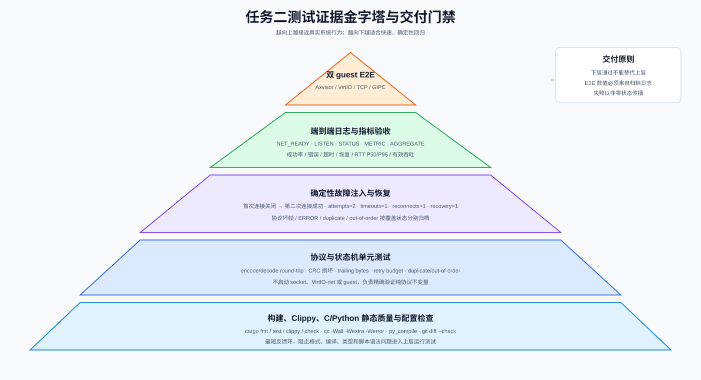
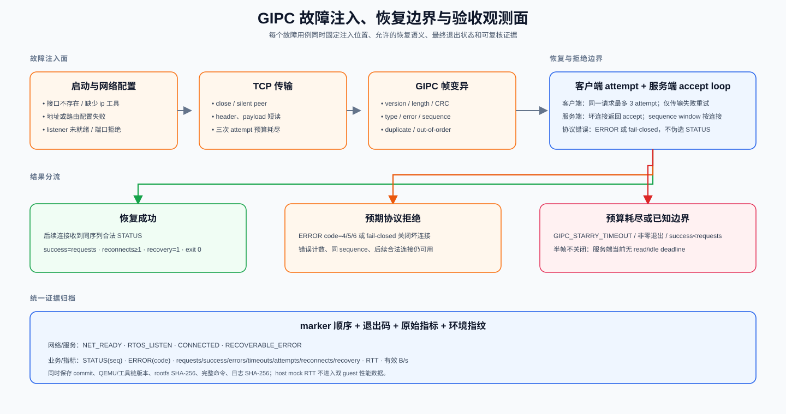
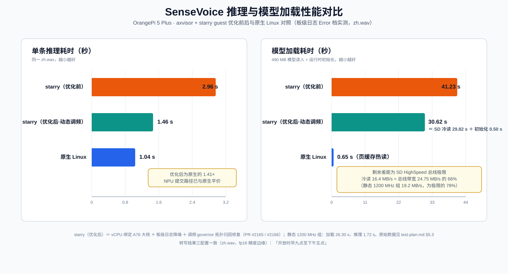

# 泉城比赛测试验收框架

## 1. 测试目标

测试验收围绕“底座 -> 链路 -> 应用”的技术关系展开，用于支撑三项任务的功能验证、性能记录和最终材料汇总。

- 任务一关注 Axvisor 自身实时性优化、AMP CPU 隔离、智能侧 guest 启动和底座稳定性。
- 任务二关注智能侧客户机与控制侧客户机之间的通信链路、协议语义、可靠性和异常处理。
- 任务三关注 AI 推理结果到控制动作的转换、控制侧执行、状态回传和端到端闭环时延。

## 2. 测试环境

| 项目 | 内容 |
| --- | --- |
| 仓库 | `tgoskits` |
| 基础系统 | Axvisor、StarryOS、实时控制任务 |
| 智能侧客户机 | Starry 生态 / Linux 兼容运行环境 |
| 实时侧 | Axvisor 预留 CPU 上的 RT 控制路径 |
| 仿真环境 | QEMU AArch64、x86_64、RISC-V、LoongArch64 |
| 板级环境 | Orange Pi 5 Plus、Roc RK3568 PC、RDK S100 等 |
| 测试目录 | `test-suit/arceos/`、`test-suit/starryos/`、`test-suit/axvisor/` |

## 3. 任务一：Axvisor 实时性与隔离底座测试

任务一测试用于观察 Axvisor 自身在智能侧 guest 和实时侧任务并存时的启动、隔离和实时运行情况。

| 测试维度 | 关注内容 | 记录材料 |
| --- | --- | --- |
| 启动与部署 | Axvisor 启动、智能侧 guest 镜像加载、VM 配置解析、实时 CPU 预留记录 | 启动日志、VM 配置、串口输出 |
| 资源隔离 | CPU、内存、设备访问边界，智能侧负载对 Axvisor 实时侧的影响 | 配置说明、压力负载日志、异常记录 |
| 实时性 | Axvisor 实时 CPU 预留、中断响应、定时器路径、vCPU 调度对 RT 任务的影响；双轮足机器人关注 8ms 平衡控制周期是否持续满足 | 平均延迟、P95/P99、最大延迟、deadline miss 次数 |
| 稳定性 | 长时间运行、客户机异常、压力负载下底座行为 | 长稳日志、panic/错误统计 |


### 1) qemu + freertos

数据来源：`benchmark-comparison-noload(1).md`，FreeRTOS Thread-Metric noload 基线，每项 30 秒、6 轮。

| 测试项 | 平均值 | 标准差 | CV |
| --- | --- | --- | --- |
| Basic Processing | 4,426,867 | 5,103 | 0.12% |
| Cooperative Scheduling | 16,351,586 | 556,189 | 3.40% |
| Preemptive Scheduling | 2,231,704 | 80,898 | 3.62% |
| Interrupt Processing | 2,236,346 | 80,898 | 3.62% |
| Interrupt Preemption | 2,230,620 | 79,287 | 3.55% |
| Message Processing | 14,511,761 | 349,668 | 2.41% |
| Synchronization | 19,393,944 | 1,014,347 | 5.23% |
| Memory Allocation | 5,358,376,202 | 4,297,447 | 0.08% |

### 2) qemu + axvisor + freertos(guest)

数据来源：`benchmark-comparison-noload(1).md`，FreeRTOS 作为 Axvisor guest 运行，noload 条件，每项 30 秒、6 轮。

| 测试项 | 平均值 | 标准差 | CV | 相对 QEMU 效率 |
| --- | --- | --- | --- | --- |
| Basic Processing | 4,408,290 | 517 | 0.01% | 基准 |
| Cooperative Scheduling | 15,464,760 | 149,777 | 0.97% | 95.0% |
| Preemptive Scheduling | 2,090,820 | 17,094 | 0.82% | 94.1% |
| Interrupt Processing | 2,090,643 | 14,433 | 0.69% | 93.9% |
| Interrupt Preemption | 2,114,955 | 9,223 | 0.44% | 95.2% |
| Message Processing | 14,099,635 | 195,310 | 1.39% | 97.5% |
| Synchronization | 18,899,591 | 336,843 | 1.78% | 97.9% |
| Memory Allocation | 5,334,546,706 | 1,859,123 | 0.03% | 99.9% |

这组数据的作用不是证明 Axvisor guest 比直接 QEMU 更快，而是说明“把完整 RTOS 作为普通 guest 运行”会把调度和中断路径继续放在虚拟化链路里：调度、中断和抢占项仍有约 4% 到 6% 的虚拟化开销。对于 8ms 双轮足平衡控制，这类开销和抖动会直接进入控制周期预算。


### 3) qemu + axvisor(amp 方案)

| 指标 | n | avg | min | max | jitter | 备注 |
| --- | --- | --- | --- | --- | --- | --- |
| Task Switch | 1000 | 5263 ns | 3600 ns | 212900 ns | 209300 ns | 任务切换 |
| Preemption | 1000 | 4271 ns | 2800 ns | 202700 ns | 199900 ns | 抢占 |
| IRQ Latency | 500 | 2859 ns | 1500 ns | 52200 ns | 50700 ns | 中断延迟 |
| Tick Delta | 500 | 999907 ns | 957500 ns | 1007600 ns | 50100 ns | 期望 1000000 ns |
| Sem Shuffle | 1000 | 4602 ns | 2900 ns | 180000 ns | 177100 ns | 信号量唤醒/切换 |

### 4) rk3588 + axvisor(amp 方案)

| 指标 | n | avg | min | max | jitter | 备注 |
| --- | --- | --- | --- | --- | --- | --- |
| Task Switch | 1000 | 1066 ns | 875 ns | 1458 ns | 583 ns | 任务切换 |
| Preemption | 1000 | 1023 ns | 875 ns | 1459 ns | 584 ns | 抢占 |
| IRQ Latency | 500 | 654 ns | 292 ns | 2792 ns | 2500 ns | 中断延迟 |
| Tick Delta | 500 | 999999 ns | 998083 ns | 1002167 ns | 4084 ns | 期望 1000000 ns |
| Sem Shuffle | 1000 | 1022 ns | 875 ns | 1167 ns | 292 ns | 信号量唤醒/切换 |





展示结论：第一张图把 QEMU 直接运行 RTOS、QEMU 运行 Axvisor+RTOS guest、QEMU 运行 Axvisor AMP 三种方案放在一起看。直接 RTOS 是性能基线；RTOS guest 仍保留 93.9% 到 99.9% 的基线效率，但调度、中断和抢占路径仍在虚拟化链路里；AMP 方案不再把高频控制闭环放进 guest，而是在 Axvisor 侧保留实时执行路径，QEMU 下任务切换、抢占、中断和信号量平均耗时处于 2.859us 到 5.263us 区间。第二张图只展示 RK3588 真机 Axvisor AMP 结果：任务切换、抢占和信号量平均耗时约 1us，中断平均耗时约 0.654us，tick jitter 约 4.084us，只占 8ms 双轮足控制周期的约 0.051%。因此 AMP 的优势不是让通用 guest 跑分超过裸 RTOS，而是让高频实时控制绕开 guest/vCPU/虚拟中断路径，把 AI 和普通系统负载限制在低频命令输入侧。


### 3.1 实测记录

| 场景 | 平台 | 命令或用例 | 关键结果 | 日志位置 | 备注 |
| --- | --- | --- | --- | --- | --- |
| Axvisor QEMU 启动 | 待补 | 待补 | 待补 | 待补 | 任务一 |
| 智能侧 guest + RT 任务启动 | 待补 | 待补 | 待补 | 待补 | 任务一 |
| Axvisor RT 周期任务延迟 | 待补 | 待补 | 待补 | 待补 | 任务一 |
| 智能侧压力负载干扰 | 待补 | 待补 | 待补 | 待补 | 任务一 |
| 双轮足 8ms 控制闭环 | Orange Pi 5 Plus + 双轮足机器人 | `rt-robot` 分支实物配置 | RT 侧持续执行 8ms balance loop，记录 deadline miss 和电机/IMU 耗时 | `assets/minicom_output.jpg`、运行串口日志 | 任务一/任务三 |

## 4. 任务二：客户机通信底座测试

任务二测试验证从 guest 启动、VirtIO-net 二层数据面、IPv4/TCP 连接，到 GIPC 控制请求、状态响应、错误通知、断连恢复和指标归档的完整证据链。测试按“静态质量 → 协议单元 → 确定性故障注入 → StarryOS/ArceOS 双 guest 端到端 → 日志与指标验收”逐层推进；下层通过不能替代上层运行证据。



### 4.1 测试对象、追溯范围与通过原则

| 被测层 | 对应 PR | 主要对象 | 关键不变量 |
| --- | --- | --- | --- |
| guest 启动与设备基础 | #1926、#1935 | PSCI/FDT、VirtIO-MMIO、镜像/rootfs | 两个 guest 可启动并发现设备；块设备不承载通信 payload |
| 二层网络 | #1927、#2155 | 双 VirtIO-net、Axvisor VirtualSwitch、MAC/IRQ/DMA | 固定 MAC、ARP/单播双向可达、源 MAC anti-spoof、无业务旁路 |
| 应用协议 | #2156 | `guest-ip-protocol`、Starry C client、ArceOS Rust server | 32 B 固定头、≤1200 B payload、大端序、CRC、同 sequence 响应 |
| 可靠性 | #2157 | TCP framing、retry、sequence window、accept recovery | 传输失败不伪造成功，只有合法 STATUS 完成请求 |
| 运行与指标 | #2158、#2159 | QEMU runner、network-init、verify/aggregate | 静态地址真实生效，错误非零传播，指标可复核 |

通过判定分为两级：QEMU 在线 regex 只承担快速冒烟；正式交付必须再检查网络和 listener marker、逐请求 sequence、完整 metric、离线 verifier/aggregator 及原始日志。正常基线要求全部请求成功且无错误；故障注入允许出现预期 timeout/recoverable marker，但必须满足场景规定的恢复或拒绝结果。

### 4.2 环境、拓扑与测试数据固定

| 项目 | 固定配置/记录要求 |
| --- | --- |
| QEMU | AArch64 `virt,virtualization=on,gic-version=3`、`cortex-a72`、4 vCPU、4 GiB、`-nographic`、180 秒门限 |
| StarryOS VM | VM 1、pCPU 1、1 GiB、MAC `52:54:00:42:00:01`、`eth0=10.0.42.1/24` |
| ArceOS VM | VM 2、pCPU 2、512 MiB、MAC `52:54:00:42:00:02`、`eth0=10.0.42.2/24`、TCP 4242 |
| 网络边界 | Axvisor 进程内 L2 switch；默认无 host bridge、TAP、NAT、uplink 或默认网关 |
| GIPC | version=1、header=32 B、max payload=1200 B、CONTROL payload=8 B |
| 运行产物 | commit、QEMU/工具链版本、rootfs SHA-256、VM 配置、完整串口日志、命令退出码 |

端到端运行前后均应保存 StarryOS 的 `ip addr show dev eth0` 与 `ip route show dev eth0`，并核对两个 VM TOML 中的固定 MAC。`ping` 只能作为 ARP/ICMP 辅助证据，不能替代 TCP CONTROL→STATUS 业务闭环。

### 4.3 分层执行命令

```bash
# 协议单元与静态质量
cargo test -p guest-ip-protocol
cargo clippy -p guest-ip-protocol --all-targets -- -D warnings
cargo check -p arceos-guest-ip-server --no-default-features
cargo clippy -p arceos-guest-ip-server \
  --no-default-features --all-targets -- -D warnings
cc -std=c11 -Wall -Wextra -Werror -O2 \
  apps/starry/guest-ip-link/linux-client.c -o /tmp/gipc-starry-client
python3 -m py_compile scripts/test/guest-ip-link/*.py

# 确定性客户端断连恢复
python3 scripts/test/guest-ip-link/test_linux_client.py

# 双 guest 端到端运行与离线验收
ROOTFS_IMAGE=<starry-rootfs.ext4> \
  os/axvisor/scripts/run-qemu-aarch64-starry-rtos-gipc.sh 2>&1 | tee <guest.log>
python3 scripts/test/guest-ip-link/verify_metrics.py <guest.log>
python3 scripts/test/guest-ip-link/aggregate_metrics.py <guest.log>
```

### 4.4 协议单元与互操作测试

仓库现有 `cargo test -p guest-ip-protocol` 包含以下确定性用例：

| ID | 现有用例 | 输入 | 精确期望 | 证明范围 |
| --- | --- | --- | --- | --- |
| P-A01 | `round_trip_preserves_header_and_payload` | CONTROL、ACK_REQUIRED、payload=`hello`、seq=7、timestamp=99 | encode/decode 后类型、序列、时间戳和 payload 保持 | Rust 侧 wire round-trip |
| P-A02 | `rejects_corrupted_payload` | 合法 STATUS 后翻转 payload bit | `ChecksumMismatch` | CRC 覆盖 payload |
| P-A03 | `rejects_trailing_bytes` | 合法空 HEARTBEAT 后追加一字节 | `PayloadLengthMismatch` | 完整长度必须等于 32+payload_len |
| R-A01 | `retries_then_times_out_with_a_bounded_budget` | timeout=10 ms、max_retries=1，在 109/110/119/120 ms 轮询 | Wait→Retransmit→Wait→TimedOut | 纯 RetryPolicy 状态机，不等于 C socket attempt |
| R-A02 | `duplicate_and_out_of_order_requests_are_not_new_work` | observe 10、10、9、11 | New、Duplicate、OutOfOrder、New | 连接内序列分类 |

需要用 raw-frame harness 补充并归档的协议专项如下。这些是测试计划，不得写成现有五个单测已经覆盖：

| ID | 注入 | 预期 |
| --- | --- | --- |
| P-F01 | bad magic/version/header_len/unknown type/error code | ArceOS fail-closed 结束当前连接并记录 recoverable error；下一合法连接仍可成功 |
| P-F02 | `payload_len=1201` 或 payload 截断 | 在无界分配前拒绝；EOF 后返回 accept |
| P-F03 | CONTROL CRC 翻转 | `ChecksumMismatch`、连接关闭、后续连接恢复 |
| P-F04 | CONTROL payload 长度 7/9 且 CRC 合法 | 同序列 ERROR `InvalidPayload=5`，连接保持可用 |
| P-F05 | 把 STATUS/ERROR 作为请求 | 同序列 ERROR `UnsupportedMessage=6` |
| P-F06 | HELLO/HEARTBEAT，payload 0..1200 B | 同序列、同 payload STATUS；当前标准 C client 不发送这两类消息 |
| P-F07 | C 端 40 B CONTROL → Rust server | 逐字段验证 STATUS 的 magic/version/length/sequence/CRC，证明 C/Rust 互操作 |
| P-F08 | ACK 请求 | 当前 server 不响应；证明 ACK 是 UDP/扩展预留，不是 TCP 成功门槛 |

### 4.5 网络启动、二层与端到端控制闭环

正常基线按照以下顺序核验，但两个 guest 并发启动时 NET_READY 与 LISTEN 的相对顺序可变化：

1. `GIPC_RTOS_READY`：应用入口已执行；不能单独证明 listener ready。
2. `GIPC_RTOS_LISTEN ip=10.0.42.2 port=4242`：ArceOS IP 配置与 bind 成功。
3. `GIPC_STARRY_NET_READY interface=eth0 address=10.0.42.1/24 peer=10.0.42.2`：StarryOS 接口和地址 ready；另保存路由输出。
4. `GIPC_RTOS_CONNECTED peer=10.0.42.1:<ephemeral>`：TCP accept 成功。
5. `GIPC_STARRY_STATUS seq=N payload=8 ...`：一次 CONTROL→STATUS 完整闭环。
6. `GIPC_STARRY_METRIC`：进程级结果；随后 verifier 输出 `GIPC_METRICS_OK`，aggregator 输出 `GIPC_AGGREGATE`。

| ID | 场景 | 操作 | 正常基线通过条件 |
| --- | --- | --- | --- |
| E01 | 网络与 listener | 启动双 guest，保存地址/路由/marker | MAC/IP/路由与配置一致；无 NET_ERROR/RTOS_ERROR |
| E02 | 单请求 CONTROL | `/usr/bin/gipc-starry-client 10.0.42.2 1` | STATUS seq=1；requests=success=1；errors/timeouts/reconnects=0；RTT/吞吐>0 |
| E03 | 多请求 sequence | `/usr/bin/gipc-starry-client 10.0.42.2 100` | STATUS seq=1..100 各一次；requests=success=100；errors=0 |
| E04 | L2 行为 | 观察 ARP、固定 MAC 和 switch counter/日志 | ARP 广播到对端；已知单播不泛洪；伪造源 MAC 被丢弃 |

多请求模式中客户端每个请求关闭并重建 TCP，服务端也为每个连接重建 sequence window。因此 E03 证明进程内序号递增和响应关联，不证明跨连接去重或 exactly-once。

### 4.6 故障注入与恢复矩阵



| ID | 故障与注入方法 | 当前预期行为 | 必查证据 | 覆盖状态 |
| --- | --- | --- | --- | --- |
| F01 | `GIPC_INTERFACE=missing0` | NET_ERROR、退出 1、客户端不启动 | 无 STATUS，非零退出 | 需脚本专项/人工 guest |
| F02 | 目标端口无 listener | 每请求最多 3 attempt，耗尽后 TIMEOUT | attempts=3、success=0、进程退出1 | 行为已实现，需确定性用例 |
| F03 | 首次 accept 后立即 close，第二次正常 | 同 sequence 重连并最终 STATUS | attempts=2、timeouts=1、reconnects=1、recovery=1 | 已有 host 自动测试；后两字段尚未显式 assert |
| F04 | accept 后静默超过接收 timeout | 客户端关闭并重试；三次静默则 TIMEOUT | timeout 计数和总预算 | 需 mock 测试 |
| F05 | 把响应头/payload 拆为 1–3 B 片段 | `read_full` 重组，不提前解析 | attempts=1、errors/timeouts=0 | 代码支持，需强制短读用例 |
| F06 | 响应 CRC/version/sequence/type 错误 | STARRY_ERROR，errors=1，不重试协议失败 | attempts=1、退出1 | 需 C client mock 测试 |
| F07 | 合法 ERROR code=5 | 打印 code/seq，errors=1，不计 success | 非零退出 | 需 mock 测试 |
| F08 | 同连接重复 CONTROL seq=10 | 第二帧分类 Duplicate，返回同序列/同 payload STATUS，不进入 New 分派 | 两个 STATUS；不宣称持久 exactly-once | Rust 分类已测，socket 路径待测 |
| F09 | 同连接先 seq=10 后 seq=9 | seq=9 返回 ERROR `InvalidSequence=4`，窗口不推进 | STATUS 10、ERROR 9、随后 seq11 可成功 | 分类已测，线上路径待测 |
| F10 | 坏帧连接后再建合法连接 | RECOVERABLE_ERROR 后 server 回到 accept | RECOVERABLE_ERROR→CONNECTED→STATUS | 需 server/双 guest 专项 |
| F11 | ArceOS 服务或 guest 重启 | 仅在客户端 3 attempt 窗口内可恢复 | 第二次 READY/LISTEN、STATUS、recovery=1 | 人工端到端 |
| F12 | 连接后只发 1–31 B 且不关闭 | 当前 server 无 read/idle deadline，串行服务可能被占用 | 记录为已知风险，不标“恢复通过” | 已知能力缺口 |

客户端 `timeouts` 实际合并 connect/send/read/payload 失败和长度超限，准确含义是“传输失败/超时 attempt 数”；协议错误和 ERROR 立即失败，不进入三次传输重试。服务端的重复/乱序只在当前连接内有效。测试报告必须区分“连接级解析失败后继续 accept”“客户端有限重连”和“整个 RTOS guest 重启恢复”三种不同能力。

### 4.7 长稳、负载与采样设计

客户端允许 1..1000 个请求。单次 1000 请求最终只产生一条 run 级平均 metric，不能形成有意义的 P50/P95。建议固定 QEMU、host CPU、构建 profile 和 rootfs，执行不少于 30 轮、每轮 100 请求，得到至少 30 条 `GIPC_STARRY_METRIC` 后再聚合。

| 场景 | 建议采样 | 记录重点 | 通过口径 |
| --- | --- | --- | --- |
| 正常基线 | 30×100 请求 | run RTT、有效 B/s、errors/timeouts | 全部请求成功，errors=0，正常基线 timeout/reconnect=0 |
| 恢复压力 | 每轮固定注入一次首次断连 | attempts、timeouts、reconnects、recovery | 最终全部成功；每轮 recovery=1；单请求≤3 attempts |
| 智能侧 CPU/内存负载 | 固定背景负载下 30×100 | 与空载 P50/P95 和吞吐对比 | 无功能失败；性能门槛依据固定基线制定 |
| 长稳 | 按固定时长/轮数循环 | panic、连接泄漏、失败趋势、最大连续失败 | 无未恢复失败；原始日志完整 |

当前代码没有固定性能 SLA，不应编造绝对 RTT/吞吐门槛。建立稳定基线后，可把“P95 不高于基线 1.20 倍、平均有效 B/s 不低于基线 0.80 倍”作为项目建议回归门槛；这不是现有脚本的强制规则，必须在报告中标注基线环境和版本。

### 4.8 指标口径与计算

| 字段 | 精确口径 |
| --- | --- |
| `requests/success` | 进程请求数 / 收到合法同序列 STATUS 的请求数 |
| client `success_rate` | `success==requests` 的 0/1，不是小数比例 |
| `errors` | response magic/version/sequence/CRC 错误、ERROR 或非 STATUS 计数；server 自身 decode error 不直接进入此字段 |
| `timeouts` | connect/send/read/payload 获取失败的 attempt 计数，不全是 deadline 到期 |
| `attempts` | 每次创建 socket 并尝试 connect 均累加；STATUS 行中的值也是进程累计值 |
| `reconnects` | 同一请求 attempt>0 且 connect 成功的次数；失败的重连和正常请求间重建连接不计入 |
| `recovery` | `success>0 && reconnects>0` 的进程级 0/1 |
| `rtt_ns` | 成功 attempt 发送前到合法 STATUS 校验后的成功请求算术平均；不含此前失败 attempt |
| `throughput_bps` | `payload_len×10^9/RTT` 的成功请求算术平均；代码未乘8，实际量纲为有效响应 payload B/s |
| aggregate `success_rate` | `Σsuccess/Σrequests`，6 位小数 |
| aggregate P50/P95 | 对每条 run 平均 RTT 排序，取 `floor((M-1)q)`；不是逐请求分位 |
| aggregate `recoveries` | `recovery=1` 的 run 数，不是恢复百分比 |

`throughput_avg_bps` 是各 run 吞吐的简单平均，不按请求数加权，也不是总 payload/总墙钟时间。聚合器虽然解析 attempts 但不输出；报告若需要 attempt 总数，应从原始 metric 另行求和。

### 4.9 自动门禁与完整验收

| 门禁 | 当前自动判据 | 必须补充的完整验收 |
| --- | --- | --- |
| QEMU regex | 180 秒内 `RTOS_READY → STATUS → METRIC`；fail 为 panic/RTOS_ERROR/STARRY_TIMEOUT | 额外要求 RTOS_LISTEN、NET_READY；检查 STARRY_ERROR/NET_ERROR/RECOVERABLE_ERROR |
| `verify_metrics.py` | STATUS/METRIC 存在；无 TIMEOUT/RTOS_ERROR/STARRY_ERROR；首个 metric 的 requests==success、RTT/吞吐>0 | 多 run 必须再跑 aggregate；核对 errors 和 marker 顺序 |
| `aggregate_metrics.py` | 找到 metric；总 success=requests 且 errors=0 返回0；允许已恢复 timeout/reconnect | 检查样本数、环境一致性、sequence、原始日志和建议性能门槛 |

正常基线的强通过条件为：LISTEN、NET_READY、至少一条同序列 STATUS 和 METRIC；`requests=success`、`errors=0`、`timeouts=0`、`attempts=requests`、`reconnects=0`、`recovery=0`、RTT/吞吐>0；无 panic、RTOS_ERROR、RECOVERABLE_ERROR、NET_ERROR、STARRY_ERROR、STARRY_TIMEOUT。故障恢复场景允许预期 timeout/recoverable marker，但必须最终 `success=requests`、`errors=0`、`reconnects≥1`、`recovery=1` 且退出0。

### 4.10 实测记录与证据归档

本节记录 2026-08-23 UTC 在实现提交 `2a891bbe949f59c7bfd037107b3615de4f57c704` 上的复测。宿主为 x86_64 Linux `4.19.90-89.11.v2401.ky10`，QEMU 10.0.11，Rust 1.99.0-nightly，GCC 14.2.0，Python 3.13.5。完整的关键输出和产物指纹见 [`assets/task2-test-evidence-20260823.md`](assets/task2-test-evidence-20260823.md)。

#### 4.10.1 构建、静态质量与底座单测

| ID | 命令 | 实测结果 | 耗时 | 结论 |
| --- | --- | --- | ---: | --- |
| S01 | `cargo test -p guest-ip-protocol` | 单元测试 5/5、doc-test 0/0；无失败、忽略或过滤 | 332 ms | PASS |
| S02 | `cargo clippy -p guest-ip-protocol --all-targets -- -D warnings` | 退出码 0，无 warning | 255 ms | PASS |
| S03 | `cargo check -p arceos-guest-ip-server --no-default-features` | ArceOS server 及依赖检查完成，退出码 0 | 867 ms | PASS |
| S04 | `cargo clippy -p arceos-guest-ip-server --no-default-features --all-targets -- -D warnings` | 退出码 0，无 Clippy warning | 1,972 ms | PASS |
| S05 | `cc -std=c11 -Wall -Wextra -Werror -O2 linux-client.c` | C11 编译退出码 0，`-Werror` 下无告警 | 65 ms | PASS |
| S06 | `python3 -m py_compile scripts/test/guest-ip-link/*.py` | 三个 Python 验证脚本语法检查退出码 0 | 22 ms | PASS |
| N01 | `cargo test -p axvirtio-net` | switch 单测 14/14、设备集成测试 18/18，共 32/32 | 3,799 ms | PASS |
| B01 | `cargo test -p axvirtio-blk` | crate 单测 3/3、集成测试 34/34、doc-test 1/1，共 38/38 | 910 ms | PASS |

`axvirtio-net` 的通过项实际覆盖固定端口注册、重复注册拒绝、广播/多播 fan-out、已知与未知单播、无 uplink 路径、源 MAC anti-spoof、inactive/stale generation 丢弃、端口注销，以及 VirtIO-net TX/RX、描述符权限、feature negotiation、ACK 与 reset。这里的 32/32 是二层交换机和设备模型的确定性证据，不等同于 StarryOS/ArceOS 的 IPv4/TCP 运行证据。

#### 4.10.2 F03 首次断连恢复实测

| 平台 | 请求/成功 | app errors | 传输失败 | attempts | reconnects/recovery | RTT/P50/P95 | 有效吞吐 | 验证器 | 结论 |
| --- | ---: | ---: | ---: | ---: | --- | --- | ---: | --- | --- |
| x86_64 host mock peer + 真实 C client | 1/1 | 0 | 1 | 2 | 1/1 | 84,449 / 84,449 / 84,449 ns | 94,731 B/s | verifier=0；aggregator=0 | PASS |

服务端第一次 `accept` 后主动关闭连接，第二次连接返回合法 STATUS。客户端以同一 sequence 重试，最终输出：

```text
GIPC_STARRY_STATUS seq=1 payload=8 attempts=2 timeouts=1
GIPC_STARRY_METRIC requests=1 success=1 success_rate=1 errors=0 timeouts=1 attempts=2 reconnects=1 recovery=1 rtt_ns=84449 throughput_bps=94731
GIPC_METRICS_OK
GIPC_AGGREGATE requests=1 success=1 success_rate=1.000000 app_errors=0 timeouts=1 reconnects=1 recoveries=1 rtt_p50_ns=84449 rtt_p95_ns=84449 throughput_avg_bps=94731
```

原始恢复日志 SHA-256 为 `a9ee4f39a51b75051f7dd12522ab8bcd49299e0afe82f1ece1153ec4dd819137`。该 RTT 和吞吐仅用于验证客户端计时、重试和聚合逻辑，不作为双 guest 性能数据。

#### 4.10.3 StarryOS/ArceOS 双 guest QEMU 实测

本轮先通过 `cargo xtask starry rootfs --arch aarch64` 获取并校验 Alpine AArch64 rootfs，再构建 StarryOS、ArceOS server 和 AArch64 静态 C client。产物如下：

| 产物 | SHA-256 | 结果 |
| --- | --- | --- |
| StarryOS `starryos.bin` | `1ab3c90f33ac178e3fda1c6992ca76b164b4d7c2c91d22c52c97d5165cede633` | AArch64 构建成功 |
| ArceOS guest server ELF | `ba5da5abf48a32199c8e4fd7b64c4e9026573ccbbfa545fede23c0842dbfab64` | AArch64 release 构建成功 |
| StarryOS client ELF | `e4b16fdce3c7821df320dcf77804a56f576676a3171d48bd48747d6a56d53922` | ELF64 AArch64、静态链接 |
| 注入前 rootfs | `b2e31e1c45d54a2a6b08f8830f1cd85868e3cf02fe647c2dc4673b4f98c2fd4e` | 镜像校验与准备成功 |

QEMU 使用 4 vCPU/4 GiB 启动 Axvisor，日志确认 `VM[1] boot success` 与 `VM[2] boot success`。随后 StarryOS 在网络初始化之前触发：

```text
[VM 1] panic
[VM 1] failed to determine root device from available block devices
=== FAIL PATTERN MATCHED: (?i)panic
```

runner 正确以退出码 1 结束，总耗时 20,007 ms；完整 QEMU 日志 SHA-256 为 `f8598c33909a424b30de00547dad32d6b12c4fa5fe426a0390af0664faf2c3a2`。本轮没有出现 `GIPC_RTOS_READY`、`GIPC_RTOS_LISTEN`、`GIPC_STARRY_NET_READY`、`GIPC_STARRY_STATUS` 或 `GIPC_STARRY_METRIC`，因此不能从该轮生成双 guest 请求成功率、RTT 或有效吞吐量。

| 用例 | 实际到达阶段 | 请求/成功 | 指标结果 | 结论 |
| --- | --- | ---: | --- | --- |
| E01 网络与 listener | Axvisor 及两个 guest 内核均启动；StarryOS rootfs 初始化失败，未进入网络脚本 | 0/0 | 无业务 metric | FAIL：未达到 LISTEN/NET_READY |
| E02 单请求闭环 | 前置 E01 未通过 | 0/0 | 不生成虚假 RTT/吞吐 | NOT RUN：被 E01 阻断 |
| E03 100 请求序列 | 前置 E01 未通过 | 0/0 | 不生成虚假成功率/P50/P95 | NOT RUN：被 E01 阻断 |
| 30×100 正常基线 | 前置 E01 未通过 | 0/0 | 无双 guest 性能样本 | NOT RUN：被 E01 阻断 |

#### 4.10.4 复测发现与总体判定

| 编号 | 复测发现 | 证据与影响 | 修复后的回归要求 |
| --- | --- | --- | --- |
| T2-D01 | runner 的 ArceOS `llvm-objcopy` 输入仍指向 `target/aarch64-unknown-none-softfloat`，当前 `xtask` 实际产物位于 `target/aarch64-unknown-linux-musl` | 原脚本在 QEMU 前退出；本轮用临时产物映射继续测试 | runner 应从 `xtask` 构建结果取得实际 ELF 路径，并在干净工作区直接启动 QEMU |
| T2-D02 | Starry VM 配置只有 `virtio-net`，没有可供 StarryOS 挂载 rootfs 的块设备 | 两个 VM 均进入内核后，VM1 报 `failed to determine root device` 并停机 | 补齐与 StarryOS 块驱动匹配的 rootfs 设备，确认 `/usr/bin/gipc-starry-client` 可见后重跑 E01–E03 |
| T2-D03 | runner 默认用宿主 `cc` 构建被注入的客户端 | x86_64 宿主会生成错误架构程序；本轮通过 `GIPC_STARRY_CLIENT_BIN` 注入 AArch64 静态 ELF | runner 应显式交叉编译或校验 ELF `Machine: AArch64`，拒绝宿主架构产物 |

截至本轮复测，协议、二层交换、VirtIO 设备模型、客户端有限重连、指标验证和聚合入口均通过；Axvisor 与两个 guest 内核能够启动，但 StarryOS rootfs 设备装配阻断了 IPv4/TCP/GIPC 业务闭环。因此任务二当前测试结论为“底层自动化通过，双 guest 业务验收未通过”，不能用 host mock 的 `84,449 ns` 和 `94,731 B/s` 代替双 guest 性能数据。修复 T2-D01～T2-D03 后，必须重新获得 LISTEN→NET_READY→STATUS→METRIC 完整 marker，并执行 100 请求及 30×100 样本聚合，才能把任务二整体状态改为 PASS。

## 5. 任务三：AI 联动应用测试

任务三测试用于观察 AI 推理、控制动作生成、通信下发、控制侧执行和状态回传的完整闭环。

| 测试维度 | 关注内容 | 记录材料 |
| --- | --- | --- |
| AI 推理 | 模型加载、样例输入、推理结果、推理耗时 | 推理日志、模型配置、性能记录 |
| 动作映射 | 推理类别、置信度、控制目标、候选动作 | 映射规则、输入输出样例 |
| 控制执行 | 控制侧解析、动作执行、状态机变化；双轮足场景记录 `forward/back/left/right/stop` 到速度和偏航目标的映射 | 控制侧日志、状态回传、演示视频 |
| 闭环时延 | 输入、推理、发送、接收、执行、回传各阶段时间戳 | 端到端时延表、统计数据 |
| 异常降级 | 低置信度、通信异常、控制侧错误等场景 | 异常日志、错误码、降级状态 |

### 5.1 端到端时间戳

| 字段 | 说明 | 来源 |
| --- | --- | --- |
| `t_input` | 输入数据进入智能侧时间 | 智能侧 |
| `t_infer_start` | AI 推理开始时间 | 智能侧 |
| `t_infer_end` | AI 推理结束时间 | 智能侧 |
| `t_send` | 控制消息发送时间 | 智能侧 |
| `t_recv_control` | 控制侧收到消息时间 | 控制侧 |
| `t_action_done` | 控制动作执行完成时间 | 控制侧 |
| `t_resp_recv` | 智能侧收到状态回传时间 | 智能侧 |

### 5.2 实测记录

| 场景 | 平台 | 命令或用例 | 关键结果 | 日志位置 | 备注 |
| --- | --- | --- | --- | --- | --- |
| 模型加载与样例推理 | OrangePi 5 Plus（axvisor + starry guest，vCPU 绑定 A76 大核，板级日志 Error 档） | SenseVoice 语音识别（RK3588 NPU，librknnrt + fp16-scaled 模型），zh/en 参考 wav 各一条 | zh.wav 转写通过（fp16 精度边缘：`开放时早九点至下午五点`，参考文本 `开饭时间早上九点至下午五点`）；单条推理 1.46s、模型加载 30.62s（动态调频组＝交付配置，PR #2165 修复 governor 拓扑归因后实测：SD 冷读 29.82s，16.4 MB/s；rknn_init 0.50s）；同构建静态 1200 MHz 组推理 1.72s、加载 26.30s（冷读 25.41s，19.2 MB/s，HighSpeed 总线 78%），两组对比见 §5.3；NPU submit 7.78 ms/次，达原生 Linux 水平（约 7.5 ms） | 串口 `[perf]` 分项计时（read model / rknn_init / 推理秒数）与内核 `[perf] rknpu <kind> ioctl stat` 聚合 | 任务三；提交默认日志档为 Warn（保留 `[perf]` 聚合），上表数字取 Error 档实测 |
| 推理结果到控制动作 | 待补 | 待补 | 待补 | 待补 | 任务三 |
| 状态回传闭环 | 待补 | 待补 | 待补 | 待补 | 任务三 |
| 负载下端到端闭环 | 待补 | 待补 | 待补 | 待补 | 任务三 |
| 语音控制双轮足机器人 | Orange Pi 5 Plus + 双轮足机器人 | `assets/control_voice.wav` + StarryOS SenseVoice/RKNN + RT wheel task | 语音命令转换为有限动作集合，机器人完成对应运动并在超时后可停止 | `assets/video.mp4`、`assets/control_voice.wav`、`assets/minicom_output.jpg` | 任务三 |

### 5.3 原始数据与对比图

三配置板级实测的串口原始输出（同一 zh.wav，日志 Error 档）：

```text
# 原生 Linux（Rockchip rknpu 驱动，页缓存热读）
[perf] model load: 0.65s
{"wav": "/opt/sensevoice/testwavs/zh.wav", "text": "开放时早九点至下午五点", "seconds": 1.0377981662750244}

# starry-no-op（优化前：A55 小核、Info 日志）
[perf] model load: 41.23s
{"wav": "/opt/sensevoice/testwavs/zh.wav", "text": "开放时早九点至下午五点", "seconds": 2.9593342909999905}

# starry-opt-nolog-dynamic-v3（优化后：vCPU 绑定 A76 大核 + Error 日志 + governor 拓扑归因修复，动态调频）
[perf] read model: 29.82s (490649722 bytes)
[perf] rknn_init: 0.50s
[perf] model load: 30.62s
{"wav": "/opt/sensevoice/testwavs/zh.wav", "text": "开放时早九点至下午五点", "seconds": 1.464541749999995}
```

上面两组均为 Error 档、同一优化构建，差别只在调频策略：`starry-opt-nolog-dynamic-v3`
叠加了 PR #2165 的 governor 拓扑归因修复（动态调频）。同构建在静态 1200 MHz
（调频不介入）下为 `read model: 25.41s`、`rknn_init: 0.66s`、`model load: 26.30s`、
推理 `1.7202s`。动态组推理更快（1.46s vs 1.72s，推理期大核可升频），代价是突发
I/O 间隙会把大核降档、SD 冷读略慢（29.82s vs 25.41s）。交付配置取动态组，
静态组数据用于说明调频策略的取舍。
三配置转写文本一致（fp16 精度边缘，均输出 `开放时早九点至下午五点`，
参考文本 `开饭时间早上九点至下午五点`）。



## 6. 综合指标记录

| 指标 | 对应任务 | 平台 | 平均值 | P95 | P99 | 最大值 | 日志位置 |
| --- | --- | --- | --- | --- | --- | --- | --- |
| Axvisor RT 周期任务延迟 | 任务一 | 待补 | 待补 | 待补 | 待补 | 待补 | 待补 |
| 客户机通信 RTT | 任务二 | 待补 | 待补 | 待补 | 待补 | 待补 | 待补 |
| AI 推理耗时 | 任务三 | OrangePi 5 Plus guest（A76 大核，日志 Error 档） | 1.46s/条（约 5.6s 音频，动态调频） | 待补 | 待补 | 8.76s（优化前 A55 小核 + Info 日志） | 串口 `[perf]` 与 `[perf] rknpu submit ioctl stat` |
| AI 到控制闭环总耗时 | 任务三 | 待补 | 待补 | 待补 | 待补 | 待补 | 待补 |
| 双轮足控制周期 | 任务一/任务三 | Orange Pi 5 Plus | 8ms 目标周期 | 待补 | 待补 | 待补 | 串口日志 / `assets/minicom_output.jpg` |
